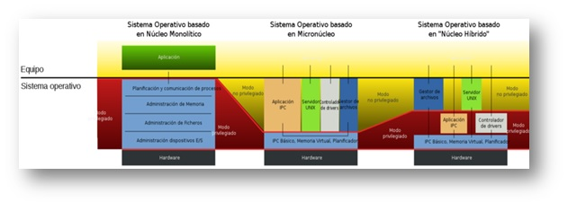
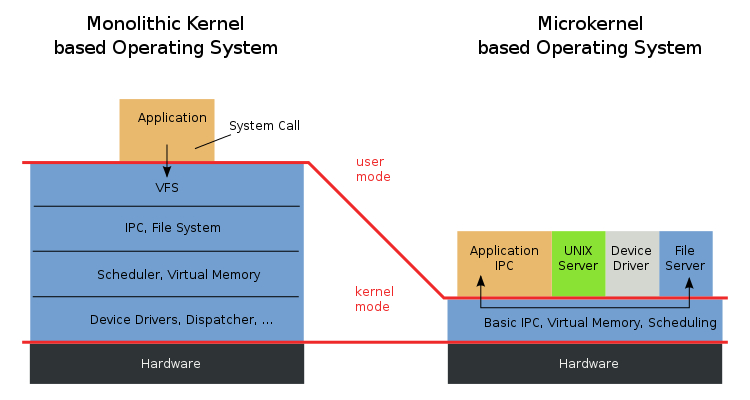
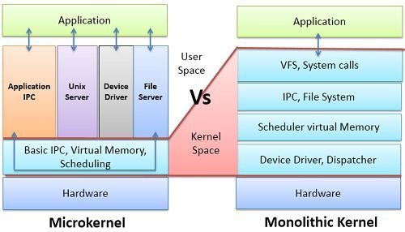

## Tipos de Kernel y sus diferencias

Un **kernel** es la parte central de un sistema operativo que actúa como intermediario entre el hardware y el software, facilitando la comunicación y el manejo de recursos del sistema. Existen diferentes tipos de kernels, cada uno con sus características distintivas. A continuación, se describen los principales tipos de kernels y sus diferencias:

### 1. Kernel Monolítico
El **kernel monolítico** es el tipo más antiguo y simple de kernel. En este enfoque, todas las funciones y servicios del sistema operativo se ejecutan en un solo espacio de memoria y en modo privilegiado. Esto significa que todos los controladores de dispositivos, la gestión de memoria, el sistema de archivos y otros componentes están incluidos en un único núcleo ejecutable. Las ventajas del kernel monolítico incluyen un alto rendimiento y una baja latencia, ya que no hay gastos generales de comunicación entre módulos. Sin embargo, una desventaja es que un error en cualquier componente puede afectar todo el sistema.

### 2. Kernel Microkernel
El **kernel microkernel** adopta un enfoque minimalista al trasladar la mayoría de los servicios y procesos del sistema operativo fuera del kernel principal. En su lugar, solo se implementan las funciones esenciales, como la gestión de memoria y la comunicación entre procesos. El resto de los servicios se ejecutan en el espacio del usuario, lo que proporciona un entorno más seguro y robusto. La ventaja clave del kernel microkernel es su alta modularidad, lo que facilita la extensibilidad y el mantenimiento del sistema. Sin embargo, debido a que las interacciones entre módulos se realizan a través de mensajes, puede haber una pérdida de rendimiento comparado con el kernel monolítico.

### 3. Kernel Híbrido
El **kernel híbrido** busca combinar características del kernel monolítico y del microkernel. En este enfoque, algunas funciones cruciales permanecen en el espacio del kernel, mientras que otras se ejecutan en el espacio del usuario como procesos. Esto permite un mejor equilibrio entre el rendimiento y la modularidad. Un ejemplo de un kernel híbrido es el **kernel de Windows**, que proporciona una capa de abstracción llamada **Executive** que maneja ciertos servicios en modo kernel, mientras que otros componentes se ejecutan en modo usuario.

Cada tipo de kernel tiene sus pros y contras, y la elección del tipo depende de los requisitos específicos del sistema operativo y del hardware en el que se ejecutará. La evolución de los sistemas operativos ha llevado a diferentes enfoques, y la selección del kernel adecuado juega un papel crucial en el rendimiento y la seguridad del sistema en general.

## Diferencia entre Modo Usuario y Modo Kernel

-----------------------------
|  Usuarios  | Modo Kernel |
|------------|-------------|
| Es un modo no privilegiado para programas de usuario | Tambien es conocido como como sistema |
| Cuando realiza un proceso se ejecuta con un acceso limitado a la memoria de CPU. | Cuando realiza un proceso tiene acceso sin restricciones al Hardware. |
--------------------------------
