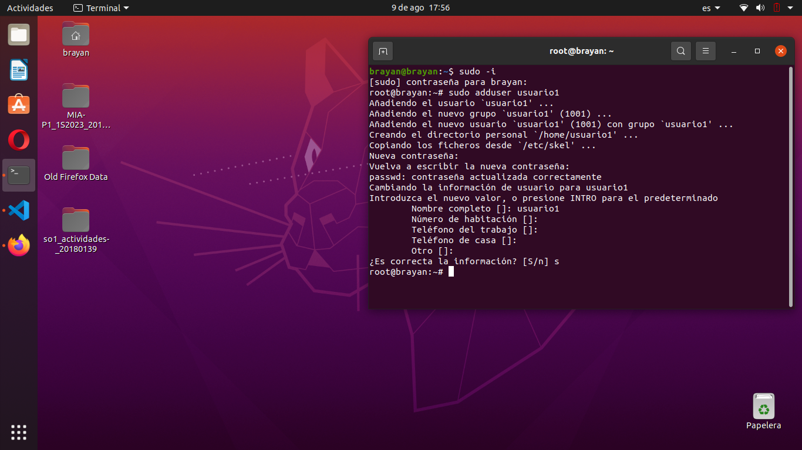

# ACTIVIDAD 3

## Parte 1 | Gestión de Usuarios

se realizaron 3 usuarios distintos por medio del comando

```
    sudo adduser usuario1
    sudo adduser usuario2
    sudo adduser usuario3
```



Posteriormente se mostro la informacion del usuario:


De ultimo se elimino el usuario 3


## Parte 2 | Gestion de Grupos

Se crearon 2 grupos por medio del comando:

```
    sudo addgroup grupo1
    sudo addgroup grupo2
```

Se agrego a los usuarios en cada uno de sus grupos:


Se verifico que estuviera cada usuario en su grupo respectivo

